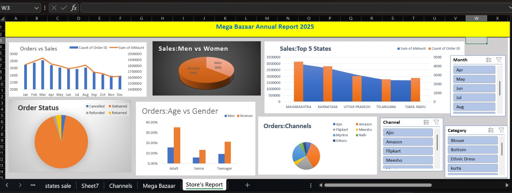

# Mega_Bazaar_Data_Analysis

This project analyzes sales data of **Mega Bazaar** using Excel pivot tables, charts, and dashboards.  
It answers key business questions, highlights customer behavior, and provides actionable insights to improve sales performance.

---

## 📈 Dashboard Preview

Below is the interactive dashboard that summarizes the analysis:

---

## 📊 Project Overview

The dataset contains detailed information about customer orders, sales channels, product categories, and demographics.  
The goal is to extract **valuable insights** for decision-making and growth strategies.

---

## 🛠 Tools Used

- **Microsoft Excel** – For data cleaning, analysis, and dashboard creation  
- **Pivot Tables & Charts** – To summarize data and answer business questions  
- **Slicers & Filters** – For dynamic report interaction  

---

## ❓ Key Business Questions Answered

1. Compare **sales and orders** using a single chart  
2. Which **month** had the highest sales and orders?  
3. Who purchased more in 2022 — **men or women**?  
4. What are the different **order statuses** in 2022?  
5. List the **top 5 states** contributing to the sales  
6. Analyze the **relation between age group and gender** based on orders  
7. Which **channel** contributes the most to sales?  
 

---

## 🔑 Sample Insights

- **Women (64%)** are more likely to purchase than men (36%)  
- **Maharashtra, Karnataka, Uttar Pradesh** are the top contributing states  
- **Adult age group (30–49 yrs)** contributes ~50% of sales  
- **Amazon, Flipkart, Myntra** are the leading sales channels  

---

## 📌 Final Conclusion

To **boost sales for Mega Bazaar**, the focus should be on:  
- Targeting **women customers (30–49 yrs)**  
- Concentrating marketing efforts in **Maharashtra, Karnataka, Uttar Pradesh**  
- Using **ads, offers, and coupons** on top channels like **Amazon, Flipkart, Myntra**  

---
